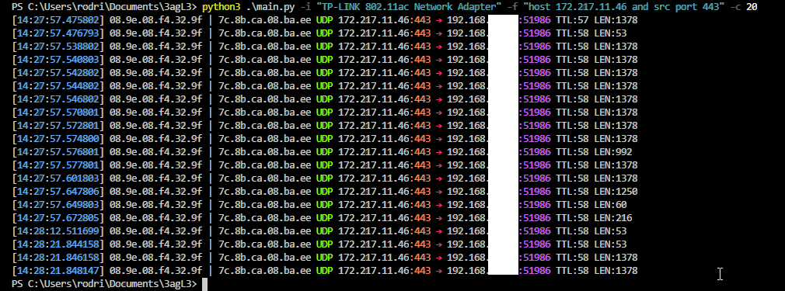

# 3agL3
Sniffing network traffic with Python for real-time or PCAP analysis.

## > Requirements
```
scapy
colored
netaddr
netifaces

# must have npcap installed
https://nmap.org/npcap/#download
```
## > Example: Live Mode


## > Example: Read Mode

## > Example: Write Mode

## > Berkeley Packet Filters
[Berkeley Packet Filters](https://www.ibm.com/support/knowledgecenter/en/SS42VS_7.3.3/com.ibm.qradar.doc/c_forensics_bpf.html)
