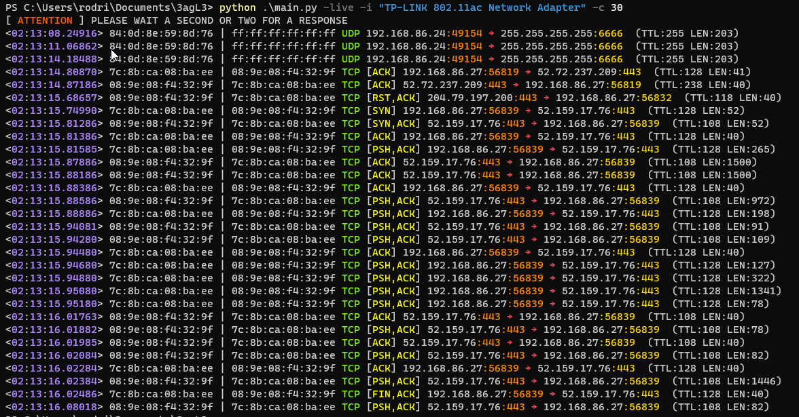
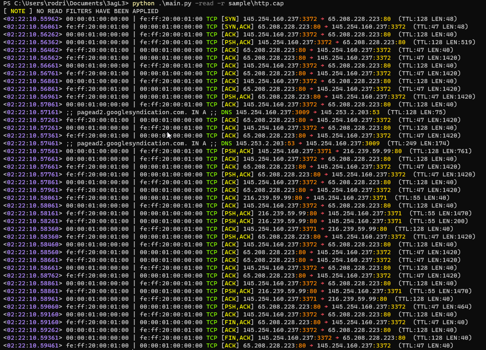
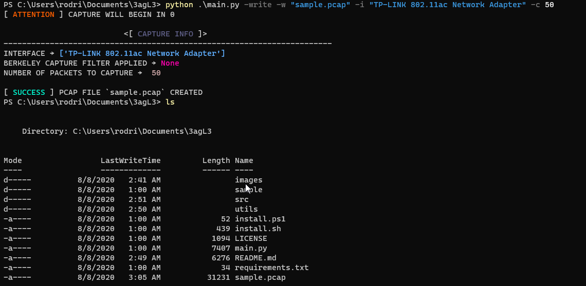
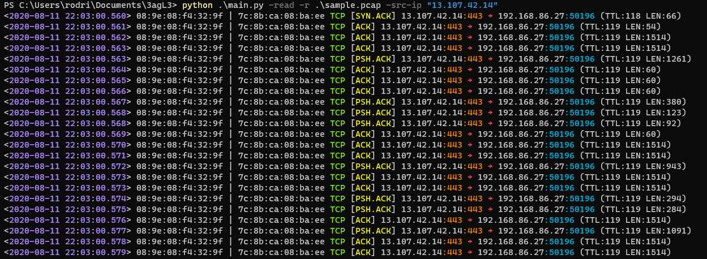
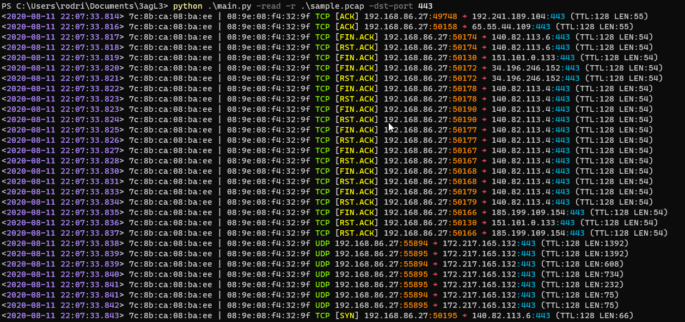
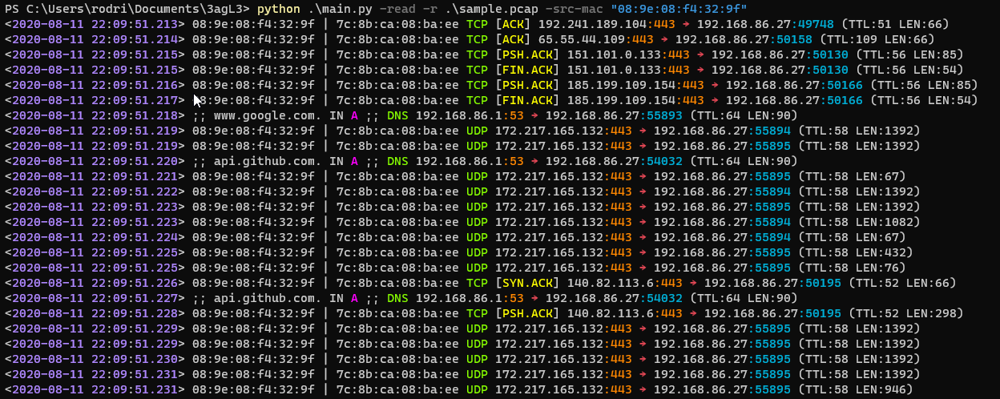
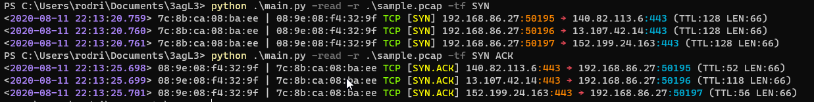

# 3agL3
Sniffing network traffic with Python for live capture observation or PCAP creation and analysis.

### Pip Requirements
```
scapy
colored
```

### Npcap/Tcpdump Installation
- Download Npcap for **Windows**:
    - https://nmap.org/download.html
- Install Tcpdump: **Ubuntu/Debian**:
    - `sudo apt install tcpdump -y`
- Install Tcpdump: **CentOS/RHEL**:
    - `yum install tcpdump -y`
    
# Installation
### Linux
```bash
wget https://raw.githubusercontent.com/binexisHATT/3agL3/master/install/install.sh
chmod +x install.sh
sudo ./install.sh
```
### Windows
```powershell
# Run PowerShell as Administrator
iwr "https://raw.githubusercontent.com/binexisHATT/3agL3/master/install/install.ps1" -out ".\install.ps1"
./install.ps1

# the following commands will only work if you have
# pip3.exe and python.exe as part of your enviromath path variable
pip3 install -r requirements.txt
python main.py -h
```

# 3agL3 Modes of Operation: Live, Read, Write
### Live Mode
**Usage**:
```
  -live, --live-mode    Perfrom live capture analysis
  -i [INTERF [INTERF ...]], --interf [INTERF [INTERF ...]]
                        The interface to listen on (more than one is allowed)
  -c <NUM>, --count <NUM>
                        The number of packets to capture (default = 0 = infinity)
  -f <BPF FITLER>, --filter <BPF FITLER>
                        Berkeley packet filter to apply to capture
```
**Capturing 30 Packets in real-time**



### Read Mode
**Usage**:
```
  -read, --read-mode    Read a PCAP file for analysis
  -r <FILENAME>, --rfile <FILENAME>
                        name of PCAP file to read for parsing
  -rc <NUM>, --read-count <NUM>
                        number of packets to read from pcap file
  -hex, --hex-dump      Print out the hex dump of each packet along with packet flow summary
  -pc, --packet-count   Prints the number of the packets within a PCAP file
  -no-prn, --no-print   Do not print out traffic flow output to console
  -src-ip-cnt <IP> [<IP> ...], --source-ip-count <IP> [<IP> ...]
                        Prints the number of times an IP address was the source IP.
                        Multiple IP addresses can be specified
  -dst-ip-cnt <IP> [<IP> ...], --destination-ip-count <IP> [<IP> ...]
                        Prints the number of times an IP addresses was the destination IP.
                        Multiple IP addresses can be specified
  -ip-cnt <IP> [<IP> ...], --ip-count <IP> [<IP> ...]
                        Prints the number of times an IP address was the source or destination IP.
                        Multiple IP addresses can be specified
```
**Reading PCAP File**



### Write Mode
**Usage**:
```
  -write, --write-mode  capture live traffic and write to PCAP file (must
                        specify `-c` option)
  -w <FILENAME>, --wfile <FILENAME>
                        name of PCAP file to create
```
**Capturing 100 packets and creating PCAP file containing these packets**



### Read/Write Mode
Most arguments can be used for both Read & Write modes:
```
  -src-ip <IP>, --source-ip <IP>
                        Filter packets based on a specified source IP address
  -not-src-ip <IP>, --not-source-ip <IP>
                        Filter packets that do not contain the specified source IP address
  -dst-ip <IP>, --destination-ip <IP>
                        Filter packets based on a specified destination IP address
  -not-dst-ip <IP>, --not-destination-ip <IP>
                        Filter packets that do not contain the specified destination IP address
  -src-port <PORT>, --source-port <PORT>
                        Filter packets based on a specified source port number
  -not-src-port <PORT>, --not-source-port <PORT>
                        Filter packets that do not contain the specified source port number
  -dst-port <PORT>, --destination-port <PORT>
                        Filter packets based on a specified destination port number
  -not-dst-port <PORT>, --not-destination-port <PORT>
                        Filter packets based on a specified destination port number
  -src-mac <MAC>, --source-mac <MAC>
                        Filter packets based on a specified source mac address
  -not-src-mac <MAC>, --not-source-mac <MAC>
                        Filter packets that do not contain the specified source mac address
  -dst-mac <MAC>, --destination-mac <MAC>
                        Filter packets based on a specified destination mac address
  -not-dst-mac <MAC>, --not-destination-mac <MAC>
                        Filter packets that do not contain the specified destination mac address
  -tcp, --filter-tcp    Filter TCP packets only
  -not-tcp, --not-filter-tcp
                        Filter for non-TCP packets only
  -udp, --filter-udp    Filter UDP packets only
  -not-udp, --not-filter-udp
                        Filter for non-UDP packets only
  -icmp, --filter-icmp  Filter ICMP packets only
  -not-icmp, --not-filter-icmp
                        Filter for non-ICMP packets only
  -arp, --filter-arp    Filter for ARP packets only
  -not-arp, --not-filter-arp
                        Filter for non-ARP packets only
  -dns, --filter-dns    Filter for DNS packets only
  -not-dns, --not-filter-dns
                        Filter for non-DNS packets only
  -tf <TCP FLAG> [<TCP FLAG> ...], --tcp-flags <TCP FLAG> [<TCP FLAG> ...]
                        Filter packets by TCP flag. Seperate each flag by spaces.
  -le <NUM>, --len-less-equal <NUM>
                        Filters for packets with a length that is less than or equal to the specified number
  -ge <NUM>, --len-greater-equal <NUM>
                        Filters for packets with a length that is greater than or equal to the specified number
  -len-eq <NUM>, --len-equal <NUM>
                        Filters for packets with a length that is equal to the specified number
  -ttl-eq <NUM>, --ttl-equal <NUM>
                        Filters for packets with a ttl that is equal to the specified number
  -sum, --summary       Summary of the packet capture <for read & write mode>
  -j <FILENAME>, --json <FILENAME>
                        Create JSON file containing capture summary (ip:count, port:count, mac:count)
```
## Berkeley Packet Filter Examples
Berkeley Packet Filter are for 3agle's **Live** and **Write** mode of operation. Berkeley Packet Filters are recommended to filter for content relevant to the content that the user is seeking. Python is no where near as fast at C at parsing network packets so it wouldn't be effective to capture in Live or Write Mode without an appropiate BP filter. 
```
# Matching IP
-------------
dst host 192.168.1.0
src host 192.168.1
dst host 172.16
src host 10
host 192.168.1.0
host 192.168.1.0/24
src host 192.168.1/24

# Matching Port/Portranges
--------------------------
src port <PORT>
dst port <PORT>
port <PORT>
src portrange 80-88
tcp portrange 1501-1549

# Matching MAC
--------------
ether host <MAC>
ether src host <MAC>
ether dst host <MAC>
```
Check out this [link](https://www.ibm.com/support/knowledgecenter/en/SS42VS_7.3.3/com.ibm.qradar.doc/c_forensics_bpf.html) for more Berkeley Packet Filters.
## Some more example usage of 3agL3
**Filtering PCAP by source IP**

**Filtering PCAP by destination port number**

**Filtering PCAP by source MAC address**

**Filtering PCAP by TCP Flags**

